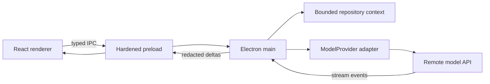
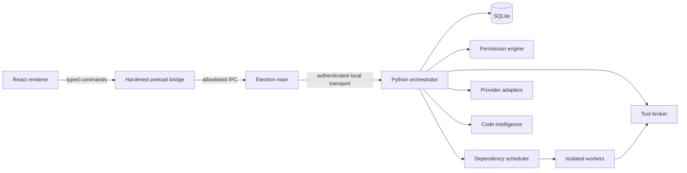

# ALTREX CODE Architecture

Status: architecture baseline for Milestone 0  
Decision owner: ALTREX core team  
Last updated: 2026-08-10

## 1. Product boundary

ALTREX CODE is a desktop control plane for repository-aware engineering agents. The desktop UI never receives direct filesystem, process, credential, or unrestricted IPC access. Privileged work is performed by capability-scoped services and recorded as structured events.

The system must remain useful with one configured model and scale to many workers without claiming model diversity that does not exist. A `Worker` is an execution identity. A `ModelEndpoint` is a provider/model/endpoint tuple. Every worker records its real endpoint.

## 2. Monorepo

```text
altrex-code/
  apps/
    desktop/                 Electron main, preload, React renderer
    frontend/                future shared browser-hosted renderer
  services/
    orchestrator/            FastAPI, asyncio scheduler, policy enforcement
    indexer/                 repository graph and incremental retrieval
  packages/
    agent-types/             worker, task, plan, review domain types
    protocol/                versioned events, commands, schemas
    provider-sdk/            provider interface and adapter test kit
    ui/                      accessible design system
    config/                  lint and TypeScript configuration
  tests/
    integration/             cross-process contract tests
    fixtures/                isolated deterministic repositories
  docs/
  migrations/               ordered SQLite migrations
```

Milestone 1 intentionally implements `apps/desktop` first. Other directories are introduced only when they contain executable production work.

## 3. Runtime topology

The first executable API milestone runs the provider boundary in Electron main so credentials and network requests never enter the renderer:



The API-first default is remote inference. Repository files, context selection, persistence, and eventual tool execution remain local. Local model servers are optional advanced OpenAI-compatible endpoints, never a hardware requirement.

The target topology introduces the orchestrator without changing this renderer trust boundary:



The renderer is treated as untrusted. Electron uses `sandbox: true`, `contextIsolation: true`, and `nodeIntegration: false`. The preload exposes named methods, never raw `ipcRenderer`. Local service transport uses a random per-launch bearer secret and binds to loopback only. The future service may use WebSocket for events and HTTP for commands; both share versioned schemas.

## 4. Bounded contexts

| Context | Responsibility | Owns |
|---|---|---|
| Desktop | windows, native dialogs, renderer lifecycle | no domain persistence |
| Session | projects, conversations, user intent | sessions, messages |
| Orchestration | plans, dependencies, worker lifecycle | tasks, workers, runs |
| Provider | model capabilities and inference | endpoints, health, usage |
| Tools | filesystem, terminal, Git, browser, MCP | approvals, action logs |
| Intelligence | repo map and context assembly | symbols, edges, chunks |
| Verification | checks, repairs, confidence evidence | test runs, findings |
| Memory | durable project facts and preferences | memories, ALTREX.md |

No adapter is allowed to write another context's tables directly. Cross-context changes go through application services and emit events in the same transaction through an outbox.

## 5. Database schema

SQLite runs in WAL mode with foreign keys enabled. IDs are UUIDv7 strings; timestamps are UTC ISO-8601. JSON columns are validated at the application boundary. Secrets are references to OS keychain entries, never secret values.

### Core tables

```sql
CREATE TABLE projects (
  id TEXT PRIMARY KEY,
  name TEXT NOT NULL,
  root_path TEXT NOT NULL UNIQUE,
  trust_level TEXT NOT NULL CHECK (trust_level IN ('untrusted','trusted')),
  created_at TEXT NOT NULL,
  last_opened_at TEXT NOT NULL
);

CREATE TABLE sessions (
  id TEXT PRIMARY KEY,
  project_id TEXT NOT NULL REFERENCES projects(id) ON DELETE CASCADE,
  title TEXT NOT NULL,
  mode TEXT NOT NULL CHECK (mode IN ('ask','plan','agent','swarm')),
  status TEXT NOT NULL,
  created_at TEXT NOT NULL,
  updated_at TEXT NOT NULL
);

CREATE TABLE messages (
  id TEXT PRIMARY KEY,
  session_id TEXT NOT NULL REFERENCES sessions(id) ON DELETE CASCADE,
  role TEXT NOT NULL CHECK (role IN ('user','assistant','system','tool')),
  content_json TEXT NOT NULL,
  created_at TEXT NOT NULL
);

CREATE TABLE tasks (
  id TEXT PRIMARY KEY,
  session_id TEXT NOT NULL REFERENCES sessions(id) ON DELETE CASCADE,
  parent_task_id TEXT REFERENCES tasks(id),
  kind TEXT NOT NULL,
  title TEXT NOT NULL,
  specification_json TEXT NOT NULL,
  state TEXT NOT NULL,
  priority INTEGER NOT NULL DEFAULT 0,
  attempt INTEGER NOT NULL DEFAULT 0,
  max_attempts INTEGER NOT NULL DEFAULT 3,
  created_at TEXT NOT NULL,
  updated_at TEXT NOT NULL
);

CREATE TABLE task_dependencies (
  task_id TEXT NOT NULL REFERENCES tasks(id) ON DELETE CASCADE,
  depends_on_task_id TEXT NOT NULL REFERENCES tasks(id) ON DELETE CASCADE,
  PRIMARY KEY (task_id, depends_on_task_id),
  CHECK (task_id <> depends_on_task_id)
);

CREATE TABLE workers (
  id TEXT PRIMARY KEY,
  task_id TEXT NOT NULL REFERENCES tasks(id) ON DELETE CASCADE,
  role TEXT NOT NULL,
  model_endpoint_id TEXT NOT NULL REFERENCES model_endpoints(id),
  workspace_id TEXT REFERENCES workspaces(id),
  status TEXT NOT NULL,
  permission_profile_id TEXT NOT NULL REFERENCES permission_profiles(id),
  token_input INTEGER NOT NULL DEFAULT 0,
  token_output INTEGER NOT NULL DEFAULT 0,
  latency_ms INTEGER,
  quality_score REAL,
  confidence REAL,
  started_at TEXT,
  completed_at TEXT
);
```

### Providers and learning

```sql
CREATE TABLE provider_configs (
  id TEXT PRIMARY KEY,
  adapter_kind TEXT NOT NULL,
  display_name TEXT NOT NULL,
  base_url TEXT,
  credential_ref TEXT,
  enabled INTEGER NOT NULL DEFAULT 1,
  privacy_class TEXT NOT NULL CHECK (privacy_class IN ('local','cloud')),
  config_json TEXT NOT NULL,
  created_at TEXT NOT NULL,
  updated_at TEXT NOT NULL
);

CREATE TABLE model_endpoints (
  id TEXT PRIMARY KEY,
  provider_config_id TEXT NOT NULL REFERENCES provider_configs(id) ON DELETE CASCADE,
  model_id TEXT NOT NULL,
  capabilities_json TEXT NOT NULL,
  context_window INTEGER,
  max_output_tokens INTEGER,
  enabled INTEGER NOT NULL DEFAULT 1,
  UNIQUE (provider_config_id, model_id)
);

CREATE TABLE model_health_samples (
  id INTEGER PRIMARY KEY AUTOINCREMENT,
  model_endpoint_id TEXT NOT NULL REFERENCES model_endpoints(id) ON DELETE CASCADE,
  state TEXT NOT NULL,
  latency_ms INTEGER,
  rate_limit_reset_at TEXT,
  detail_json TEXT NOT NULL,
  observed_at TEXT NOT NULL
);

CREATE TABLE model_performance (
  model_endpoint_id TEXT NOT NULL REFERENCES model_endpoints(id) ON DELETE CASCADE,
  task_category TEXT NOT NULL,
  sample_count INTEGER NOT NULL DEFAULT 0,
  success_ema REAL NOT NULL DEFAULT 0,
  quality_ema REAL NOT NULL DEFAULT 0,
  latency_ema_ms REAL NOT NULL DEFAULT 0,
  cost_ema REAL NOT NULL DEFAULT 0,
  updated_at TEXT NOT NULL,
  PRIMARY KEY (model_endpoint_id, task_category)
);
```

### Execution, safety, memory, and indexing

```sql
CREATE TABLE workspaces (
  id TEXT PRIMARY KEY,
  project_id TEXT NOT NULL REFERENCES projects(id) ON DELETE CASCADE,
  kind TEXT NOT NULL CHECK (kind IN ('main','worktree','container','temporary_clone')),
  path TEXT NOT NULL,
  git_ref TEXT,
  owner_worker_id TEXT,
  state TEXT NOT NULL,
  created_at TEXT NOT NULL
);

CREATE TABLE permission_profiles (
  id TEXT PRIMARY KEY,
  project_id TEXT REFERENCES projects(id) ON DELETE CASCADE,
  name TEXT NOT NULL,
  rules_json TEXT NOT NULL,
  created_at TEXT NOT NULL,
  updated_at TEXT NOT NULL
);

CREATE TABLE approvals (
  id TEXT PRIMARY KEY,
  task_id TEXT NOT NULL REFERENCES tasks(id) ON DELETE CASCADE,
  worker_id TEXT REFERENCES workers(id),
  capability TEXT NOT NULL,
  request_json TEXT NOT NULL,
  decision TEXT NOT NULL CHECK (decision IN ('pending','approved','denied','expired','cancelled')),
  scope_json TEXT,
  requested_at TEXT NOT NULL,
  decided_at TEXT
);

CREATE TABLE action_log (
  id INTEGER PRIMARY KEY AUTOINCREMENT,
  task_id TEXT,
  worker_id TEXT,
  action_type TEXT NOT NULL,
  redacted_payload_json TEXT NOT NULL,
  outcome TEXT NOT NULL,
  occurred_at TEXT NOT NULL
);

CREATE TABLE checkpoints (
  id TEXT PRIMARY KEY,
  project_id TEXT NOT NULL REFERENCES projects(id) ON DELETE CASCADE,
  task_id TEXT REFERENCES tasks(id),
  label TEXT NOT NULL,
  git_ref TEXT NOT NULL,
  manifest_json TEXT NOT NULL,
  created_at TEXT NOT NULL
);

CREATE TABLE memories (
  id TEXT PRIMARY KEY,
  project_id TEXT REFERENCES projects(id) ON DELETE CASCADE,
  scope TEXT NOT NULL CHECK (scope IN ('project','global')),
  key TEXT NOT NULL,
  value_json TEXT NOT NULL,
  source TEXT NOT NULL,
  confidence REAL NOT NULL,
  updated_at TEXT NOT NULL,
  UNIQUE (project_id, scope, key)
);

CREATE TABLE repo_files (id TEXT PRIMARY KEY, project_id TEXT NOT NULL, path TEXT NOT NULL, hash TEXT NOT NULL, language TEXT, indexed_at TEXT NOT NULL, UNIQUE(project_id,path));
CREATE TABLE repo_symbols (id TEXT PRIMARY KEY, file_id TEXT NOT NULL, kind TEXT NOT NULL, name TEXT NOT NULL, range_json TEXT NOT NULL, signature TEXT);
CREATE TABLE repo_edges (id INTEGER PRIMARY KEY AUTOINCREMENT, project_id TEXT NOT NULL, from_id TEXT NOT NULL, to_id TEXT NOT NULL, kind TEXT NOT NULL);
CREATE TABLE event_outbox (sequence INTEGER PRIMARY KEY AUTOINCREMENT, aggregate_id TEXT NOT NULL, event_type TEXT NOT NULL, schema_version INTEGER NOT NULL, payload_json TEXT NOT NULL, occurred_at TEXT NOT NULL, published_at TEXT);
```

Indexes cover foreign keys, `tasks(state, priority)`, `workers(status)`, `action_log(task_id, occurred_at)`, and FTS5 virtual tables for lexical code search. Embedding records contain provider/model identity so vectors are never mixed across incompatible models.

## 6. Universal model provider interface

Provider adapters implement transport, normalization, health, and capability discovery only. They do not plan tasks or bypass policy.

```ts
interface ModelProvider {
  readonly kind: string;
  validateConfig(config: ProviderConfig): Promise<ValidationResult>;
  listModels(signal: AbortSignal): Promise<ModelDescriptor[]>;
  health(endpoint: ModelEndpoint, signal: AbortSignal): Promise<HealthSample>;
  stream(request: ModelRequest, signal: AbortSignal): AsyncIterable<ModelStreamEvent>;
  countTokens?(input: ModelInput): Promise<TokenCount>;
}

interface ModelRequest {
  requestId: string;
  endpoint: ModelEndpoint;
  messages: StructuredMessage[];
  tools: ToolDefinition[];
  outputSchema?: JsonSchema;
  sampling: { temperature?: number; maxOutputTokens: number };
  privacy: { repositoryData: boolean; consentId?: string };
}
```

The first adapter is OpenAI-compatible and currently backs OpenAI, OpenRouter, Groq, and generic user-supplied endpoints. Gemini receives a native adapter after this one-provider flow passes end-to-end validation. Ollama and LM Studio remain optional advanced local endpoints. The conformance suite verifies cancellation, streaming, tool-call normalization, usage accounting, rate-limit reporting, redaction, timeout behavior, and malformed-response handling.

## 7. Code intelligence

Indexing is incremental and cancellable. File watching invalidates only changed paths. The retrieval pipeline combines path/tree priors, ripgrep matches, symbols and references, import graph proximity, recent Git changes, session context, project memory, and optional embeddings. Every context item carries source path, range, hash, retrieval reason, and token estimate. Agents receive a budgeted context pack rather than a repository dump.

## 8. SWARM architecture

The scheduler supports 100 concurrent worker records, but admission control is based on healthy unique endpoints, provider rate limits, CPU, RAM, terminal limits, cost policy, and dependency readiness. `SWARM-100` is enabled only when the user opts in and the requested worker/endpoint configuration passes health and quota checks.

Workers sharing an endpoint are explicitly displayed as sharing it. Endpoint diversity and worker concurrency are separate metrics. Each worker has a cancellable task group, isolated log stream, context manifest, workspace lease, permission profile, usage meter, and result envelope.

Smart Swarm first classifies complexity, then chooses a bounded worker budget. It may use 1–2 workers for tiny work, 3–5 for defects, 5–10 for features, 8–20 for refactors, 20–50 for exceptional work, and up to 100 only in experimental mode. These are ceilings, not quotas.

## 9. Confidence

Confidence is computed from evidence, not self-report. A versioned scoring policy combines mandatory check completion, pass ratios, independent review agreement, unresolved severity-weighted findings, patch surface, regression coverage, and runtime verification. The UI shows the evidence list and marks unavailable checks as unavailable—not passed.

## 10. Failure and recovery

Commands and model requests are idempotent where possible and carry correlation IDs. Event consumers checkpoint sequence numbers. A crashed worker lease expires and is recoverable. The verify-and-repair loop has explicit retry, time, token, and cost limits. Before material edits, the system creates a recoverable Git-backed checkpoint. Cancellation propagates from task to workers, model streams, terminals, and tool calls.
